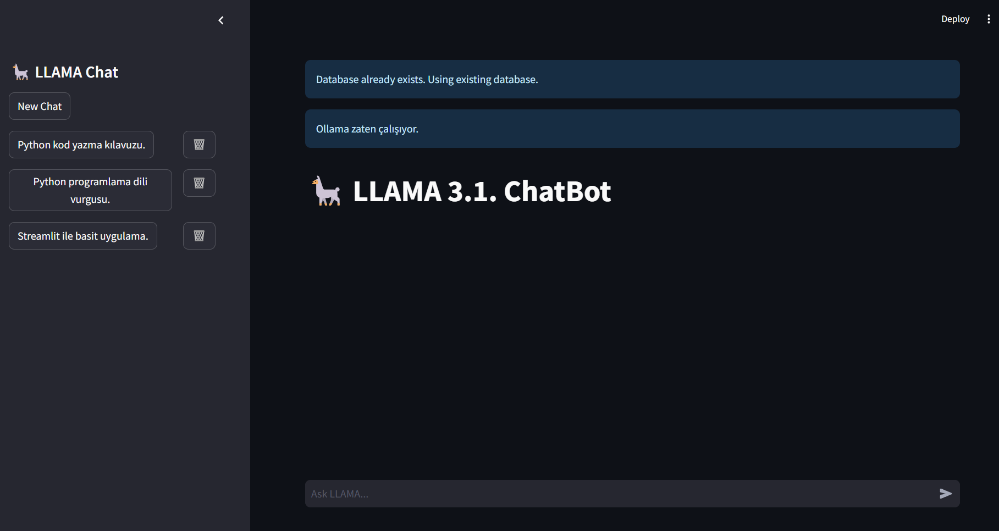

# LLAMA 3.1 Chat

LLAMA 3.1 Chat, Streamlit kullanarak oluşturulmuş, LLAMA 3.1 dil modeliyle etkileşime girmenizi sağlayan bir sohbet uygulamasıdır. Bu uygulama, kullanıcıların farklı LLAMA modelleri arasında geçiş yapmasına, sohbet geçmişini kaydetmesine ve yönetmesine olanak tanır.



## Özellikler

- 🦙 LLAMA 3.1 dil modeli ile sohbet
- 📊 Farklı LLAMA modelleri arasında geçiş yapabilme
- 💾 Sohbet geçmişini kaydetme ve yükleme
- 🗑️ Eski sohbetleri silme
- 📝 Sohbet özetleri oluşturma
- 🖼️ Kullanıcı dostu arayüz

## Kurulum

1. Repository'yi klonlayın:
   ```
   git clone https://github.com/your-username/llama-3.1-chat.git
   cd llama-3.1-chat
   ```

2. Gerekli kütüphaneleri yükleyin:
   ```
   pip install -r requirements.txt
   ```

3. `.streamlit/config.json` dosyasını oluşturun ve Groq API anahtarınızı ekleyin:
   ```json
   {
     "GROQ_API_KEY": "your-groq-api-key-here"
   }
   ```

## Kullanım

1. Uygulamayı çalıştırın:
   ```
   streamlit run main.py
   ```

2. Web tarayıcınızda açılan uygulamayı kullanın.
3. Sidebar'dan istediğiniz LLAMA modelini seçin.
4. Sohbet alanına mesajınızı yazın ve LLAMA ile sohbet edin.
5. Yeni bir sohbet başlatmak için "New Chat" butonunu kullanın.
6. Eski sohbetleri görüntülemek veya silmek için sidebar'daki sohbet özetlerini kullanın.

## Notlar

- Bu uygulama, Groq API'sini kullanmaktadır. Geçerli bir API anahtarına sahip olduğunuzdan emin olun.
- LLAMA modelleri, büyük miktarda işlem gücü gerektirebilir. İşlem süresi, seçilen modele ve sorunun karmaşıklığına göre değişebilir.
- Sohbet geçmişi ve özetler yerel bir SQLite veritabanında saklanır.

## Katkıda Bulunma

Katkılarınızı memnuniyetle karşılıyoruz! Lütfen bir pull request göndermeden önce değişikliklerinizi tartışmak için bir issue açın.

## Lisans

//////////////////////////
